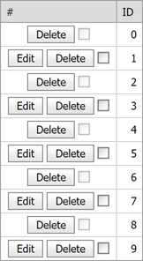

<!-- default badges list -->

[](https://supportcenter.devexpress.com/ticket/details/E366)
[](https://docs.devexpress.com/GeneralInformation/403183)
<!-- default badges end -->

# Grid View for ASP.NET Web Forms - How to Customize Command Buttons in Individual Rows

<!-- run online -->
**[[Run Online]](https://codecentral.devexpress.com/e366/)**
<!-- run online end -->


This example demonstrates how to hide or disable a [command item](https://docs.devexpress.com/AspNet/3689/components/grid-view/visual-elements/command-item) (button or checkbox) in the grid's [command column](https://docs.devexpress.com/AspNet/3701/components/grid-view/concepts/data-representation-basics/columns/command-columns?p=netframework).



To do this, handle the [CommandButtonInitialize](https://docs.devexpress.com/AspNet/DevExpress.Web.ASPxGridView.CommandButtonInitialize) event. This event is raised for each built-in command button. In the event handler, use the e.[ButtonType](https://docs.devexpress.com/AspNet/DevExpress.Web.ASPxGridViewCommandButtonEventArgs.ButtonType) property to determine the button type. Then, depending on the `ButtonType` property value, use the e.[Visible](https://docs.devexpress.com/AspNet/DevExpress.Web.ASPxGridCommandButtonEventArgs.Visible) to hide the button or use the e.[Enabled](https://docs.devexpress.com/AspNet/DevExpress.Web.ASPxGridCommandButtonEventArgs.Enabled) property to disable the checkbox.

```cs
protected void ASPxGridView1_CommandButtonInitialize(object sender, DevExpress.Web.ASPxGridViewCommandButtonEventArgs e) {
    bool isOddRow = e.VisibleIndex % 2 == 0;
    if(isOddRow) {  // some condition
        // hide the Edit button
        if(e.ButtonType == DevExpress.Web.ColumnCommandButtonType.Edit)
            e.Visible = false;

        // disable the selection checkbox
        if(e.ButtonType == DevExpress.Web.ColumnCommandButtonType.SelectCheckbox)
            e.Enabled = false;
    }
}
```

## Files to Look At

* [Default.aspx](./CS/HideCommandButtons/Default.aspx) (VB: [Default.aspx](./VB/HideCommandButtons/Default.aspx))
* [Default.aspx.cs](./CS/HideCommandButtons/Default.aspx.cs) (VB: [Default.aspx](./VB/HideCommandButtons/Default.aspx))

## Documentation

* [ASPxGridView](https://docs.devexpress.com/AspNet/DevExpress.Web.ASPxGridView)
* [Grid View - Command Columns](https://docs.devexpress.com/AspNet/3701/components/grid-view/concepts/data-representation-basics/columns/command-columns)
* [Grid View - Examples](https://docs.devexpress.com/AspNet/3768/components/grid-view/examples)

## More Examples

* [How to hide a cell value](https://github.com/DevExpress-Examples/how-to-hide-a-cell-value-e365)
* [How to hide template controls in individual cells](https://github.com/DevExpress-Examples/how-to-hide-template-controls-in-individual-cells-e1385)
* [How to conditionally disable the UpdateButton in client code](https://github.com/DevExpress-Examples/how-to-conditionally-disable-the-updatebutton-in-client-code-e450)
* [How to create a custom command button with the appearance and action depending on a row state](https://github.com/DevExpress-Examples/how-to-create-a-custom-command-button-with-the-appearance-and-action-depending-on-a-row-state-e1246)
* [How to enable/disable command buttons on the client side](https://github.com/DevExpress-Examples/how-to-enable-disable-command-buttons-on-the-client-side-e2345)
